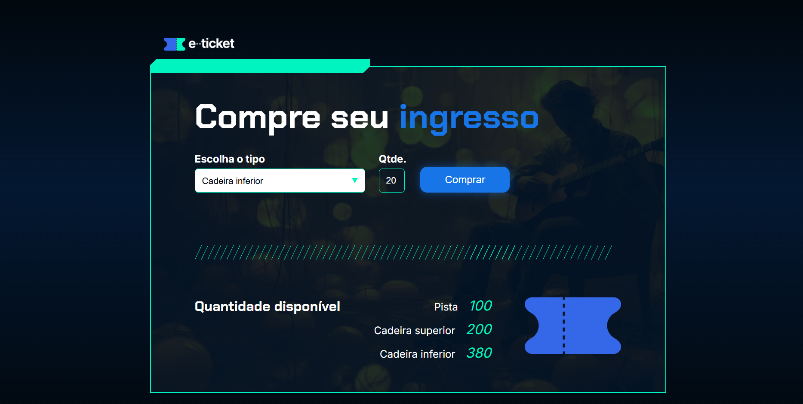

# 🎟️ e-Ticket

Sistema simples e funcional para compra de ingressos online.  
Permite ao usuário escolher o tipo de ingresso, selecionar a quantidade desejada e visualizar o estoque disponível em tempo real.

---

## 📸 Preview

 

---

## 🚀 Funcionalidades

- Seleção de tipo de ingresso: `Pista`, `Cadeira superior`, `Cadeira inferior`.
- Controle de quantidade por tipo.
- Atualização automática do estoque após cada compra.
- Feedback ao usuário via alertas.
- Layout responsivo e visual moderno.

---

## 🧠 Tecnologias Utilizadas

- **HTML5** – Estrutura semântica.
- **CSS3** – Estilização com fontes personalizadas e layout responsivo.
- **JavaScript** – Lógica de negócio para compra e controle de ingressos.
- **Google Fonts** – Chakra Petch & Inter.
- **Imagens SVG/PNG** – Design gráfico do site.
